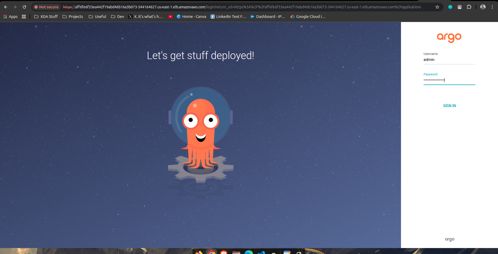
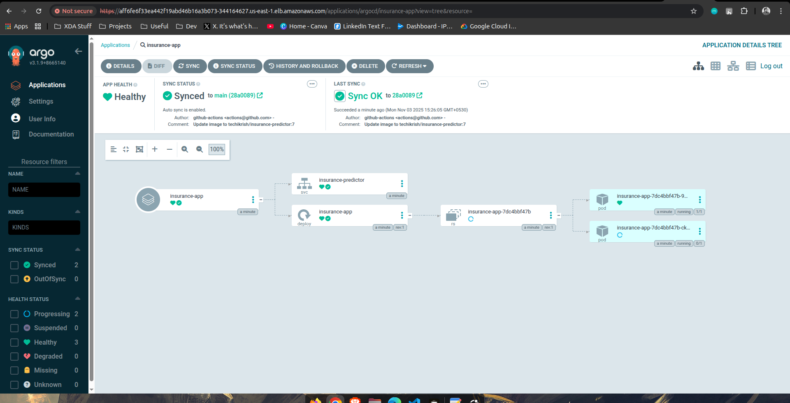
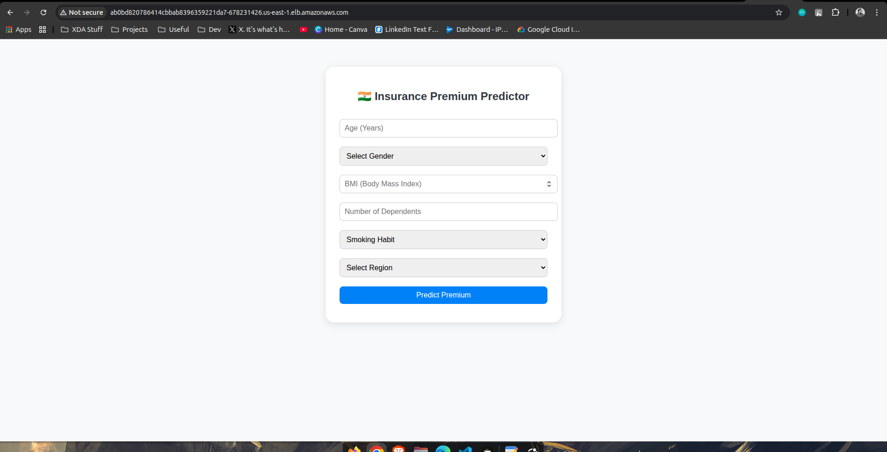

# 🧠 Insurance Premium Predictor basic MLOps Project

An **end-to-end MLOps pipeline** that predicts insurance premiums based on user data.

This project demonstrates how to automate model training, containerization, deployment, and continuous delivery using **GitHub Actions**, **Terraform**, **Amazon EKS**, and **Argo CD** — all powered by **GitOps**.

---


### 🚀 Project Architecture

This pipeline follows a **GitOps driven CI/CD workflow**:

1. **Terraform** provisions infrastructure  EKS, VPC, subnets, and node groups.
2. **GitHub Actions**:
    - Trains ML model
    - Builds Docker image
    - Pushes image to Docker Hub
    - Updates Kubernetes manifests automatically
3. **Argo CD** detects manifest changes and syncs the app on EKS.
4. **Kubernetes** manages pods, services, and load balancing automatically.

### 

### ⚙️ Setup & Execution

### **1️⃣ Clone the Repository**

```bash
git clone https://github.com/Techikrish/MlOps-insurance-predictor.git
cd MlOps-insurance-predictor

```

---

### 🌍 Step 2: Provision Infrastructure with Terraform

```bash
cd terraform
terraform init
terraform apply

```

This will create:

- VPC and Subnets
- EKS Cluster
- Node Group

Once complete, configure kubectl:

```bash
aws eks --region us-east-1 update-kubeconfig --name <your-cluster-name>
kubectl get nodes

```

---

### ⚙️ Step 3: Install Argo CD on EKS

```bash
kubectl create namespace argocd
kubectl apply -n argocd -f https://raw.githubusercontent.com/argoproj/argo-cd/stable/manifests/install.yaml

```

Expose Argo CD using a LoadBalancer service:

```bash
kubectl patch svc argocd-server -n argocd -p '{"spec": {"type": "LoadBalancer"}}'

```

Get Argo CD admin password:

```bash
kubectl -n argocd get secret argocd-initial-admin-secret -o jsonpath="{.data.password}" | base64 -d

```

Then access the dashboard:



```bash
kubectl get svc -n argocd

```

Login via browser using the **EXTERNAL-IP** of `argocd-server`.

---

### 🔄 Step 4: Deploy Argo CD Application

```bash
kubectl apply -f argocdapp.yaml

```

Argo CD will automatically sync the manifests under the `k8s/` folder and deploy your app to EKS.



### 🌐 Step 6: Access the Deployed App

Once deployed, get the LoadBalancer URL:

```bash
kubectl get svc insurance-predictor -n default

```

Then open the `EXTERNAL-IP` in your browser.



### 📖 Want to Learn the Full Execution & Setup?

To explore **every step** — from provisioning infrastructure with Terraform, configuring Argo CD on EKS, connecting GitHub Actions, and deploying the ML app —

read the full detailed article on **Medium** 👇

### [👉 **Read the complete execution guide on Medium**](https://medium.com/@krishnafattepurkar/end-to-end-simple-mlops-pipeline-with-terraform-eks-github-actions-argo-cd-a632a9111060)